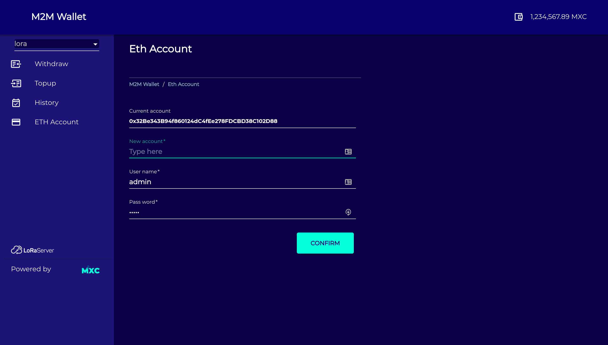

-----------------

-m2m-wallet
--------------
M2M wallet, as a part of MXProtocol is responsible for the Payments and accounting among machines (gateways, and devices) in MXC network.   
M2M wallet will be used for accounting of allocating and obtaining network resources, Smart Machine Bidding and Data Market Place of MXProtocol.  
To this end, each entity in MXC network has a corresponding wallet in M2M wallet.  

At the first stage, MXC M2M wallet will be used in the MXProtocol MVP. MXProtocol MVP will be released in Q4 2019.  

__Note that this preliminary version of M2M wallet is under development and supposed to be improved.__  
__Additional features will be added to M2M wallet  based on the MXProtocol design.__ 

#### To run m2m-wallet service, three services are needed:

- lora-app-server (open source, modified by MXC)  
$ git clone --single-branch -b UI/m2m-wallet git@gitlab.com:MXCFoundation/cloud/lora-app-server.git  
- payments-service (not open, created by MXC)  
- mxprotocol-server (open source, created by MXC)  
$ git clone --single-branch -b develop git@gitlab.com:MXCFoundation/cloud/mxprotocol-server.git  

#### Steps to start m2m-wallet service:
mkdir -p $(go env GOPATH)/src/gitlab.com/MXCFoundation/cloud/   

-get lora-app-server and m2m-wallet service  
cd $(go env GOPATH)/src/gitlab.com/MXCFoundation/cloud/   
git clone --single-branch -b UI/m2m-wallet git@gitlab.com:MXCFoundation/cloud/lora-app-server.git   
git clone --single-branch -b develop git@gitlab.com:MXCFoundation/cloud/mxprotocol-server.git   

-get payments-service (not open)   
cd $(go env GOPATH)/src/gitlab.com/MXCFoundation/   
git clone --single-branch -b docker git@gitlab.com:MXCFoundation/payments-service.git   

-start lora-app-server in terminal 1  
cd $(go env GOPATH)/src/gitlab.com/MXCFoundation/cloud/lora-app-server  
docker-compose up -d  
docker-compose exec appserver bash  
make clean; make ui-requirements  
make build  
./build/lora-app-server  

-start payments-service in terminal 2  
cd $(go env GOPATH)/src/gitlab.com/MXCFoundation/payments-service  
docker-compose up -d  
docker-compose exec payment bash  
make test_run  

-start mxprotocol-server in terminal 3  
cd $(go env GOPATH)/src/gitlab.com/MXCFoundation/cloud/mxprotocol-server  
docker-compose up -d  
docker-compose exec mxprotocol-server bash  
make clean; make ui-requirements  
make all  
./m2m-wallet/build/m2m-wallet  

-connect three services' network  
docker network ls // for getting network name of lora-app-server and payments-service  
docker ps // for getting container id of mxprotocol-server  
docker network connect $(network name of lora-app-server) $(container id of mxprotocol-server)  
docker network connect $(network name of payments-service) $(container id of mxprotocol-server)  

#### Start visiting the service
Authentication center is within lora-app-server currently, it is restricted that user must login on lora-app-server first, then relocate to m2m-wallet service.  
1. Open your browser and visit localhost:8080 

2. Login as admin/admin, click bottom left button __M2M WALLET__

Your page is then redirected to __M2M WALLET__

3. Explore __M2M WALLET__ now :) You can relocate yourself back to lora-app-server whenever you want by clicking bottom left button __LoRaServer__
- withdraw page

- TopUp page

- History page

- ETH Account page

