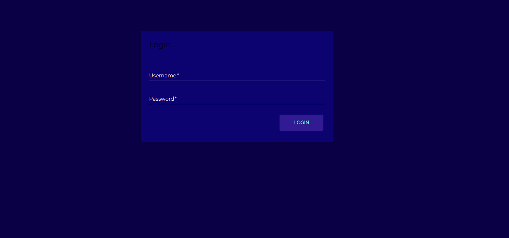
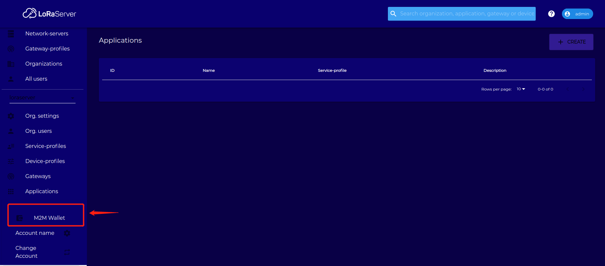
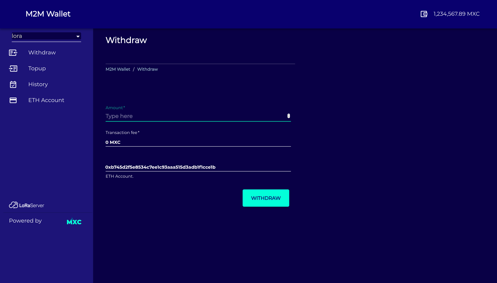
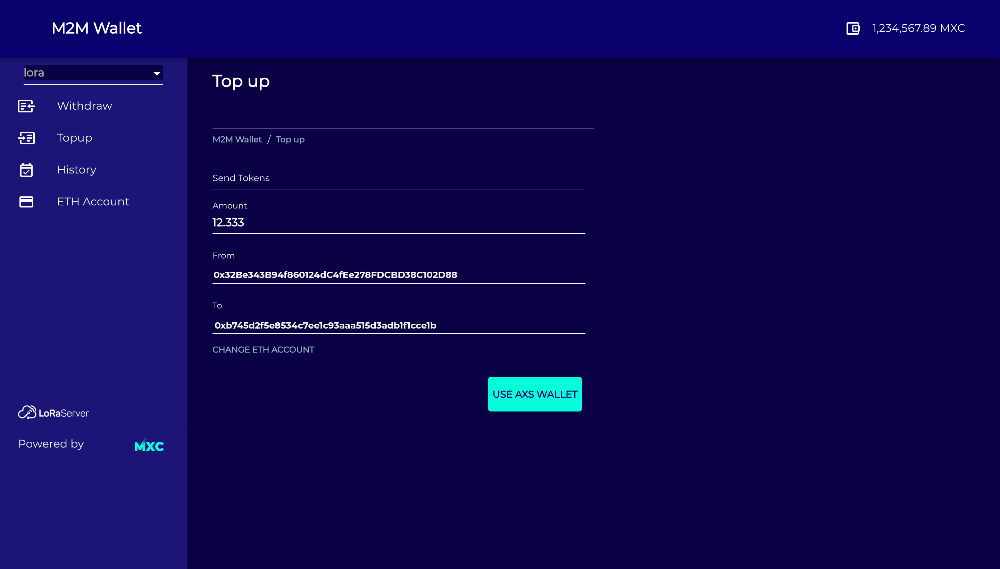
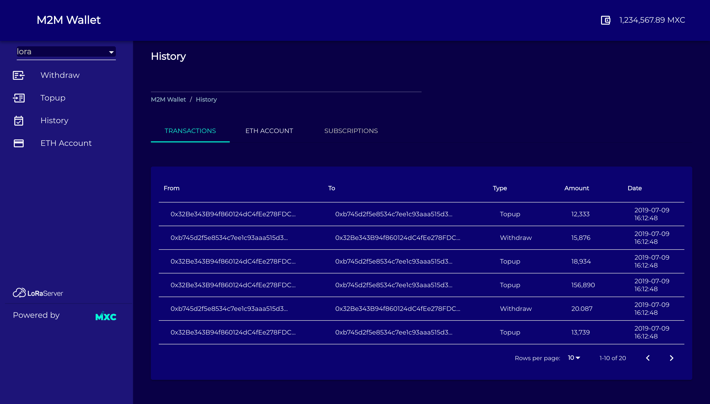

-----------------

-m2m-wallet
--------------
M2M wallet, as a part of MXProtocol is responsible for the Payments and accounting among machines (gateways, and devices) in MXC network.   
M2M wallet will be used for accounting allocated and obtained network resources, Smart Machine Bidding and Data Market Place of MXProtocol.  
Every organization (may have gateways or/and IoT devices) in MXC network has a corresponding wallet in M2M wallet.

At the first stage, MXC M2M wallet will be used in the MXProtocol MVP. MXProtocol MVP will be released in Q4 2019.  

__Note.__ This preliminary version of M2M wallet is under development and supposed to be improved. 
Additional features will be added to M2M wallet  based on the MXProtocol design.

#### To run m2m-wallet service, three services are needed:

- lora-app-server (open source)  
$ git clone https://github.com/mxc-foundation/lora-app-server.git 
- payments-service (not open)  
- mxprotocol-server (open source)
$ git clone https://github.com/mxc-foundation/mxprotocol-server.git  

#### Start visiting the service
Authentication center is within lora-app-server currently, it is restricted that user must login on lora-app-server first, then relocate to m2m-wallet service.  
1. Open your browser and visit localhost:8080 

2. Login as admin/admin, click bottom left button __M2M WALLET__

Your page is then redirected to __M2M WALLET__

3. Explore __M2M WALLET__ now :) You can relocate yourself back to lora-app-server whenever you want by clicking bottom left button __LoRaServer__
- withdraw page

- TopUp page

- History page

- ETH Account page

